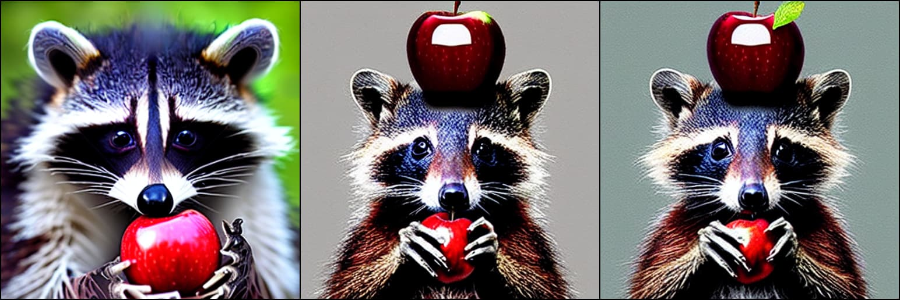
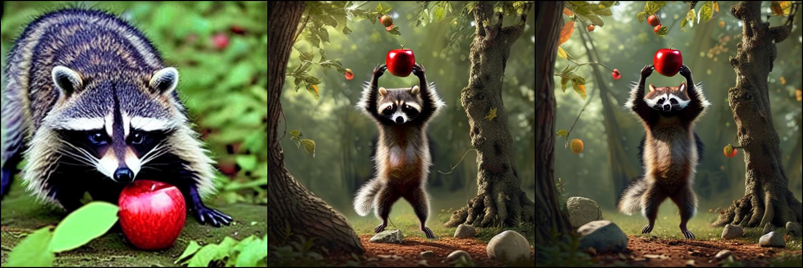
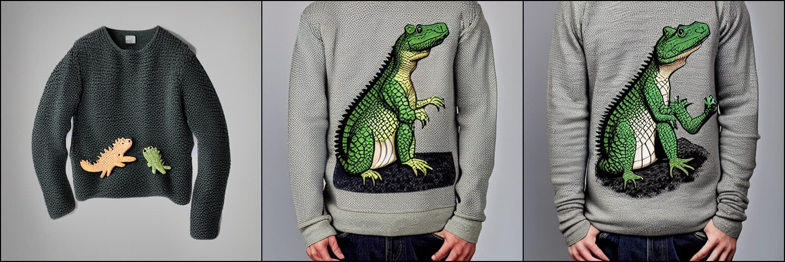
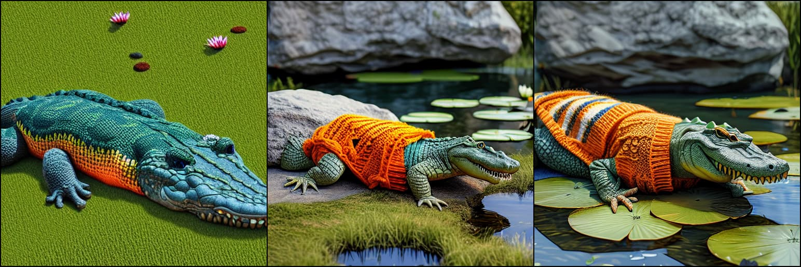

# ELLA: Equip Diffusion Models with LLM for Enhanced Semantic Alignment

<div align="center">
<span class="author-block">
    <a href="https://openreview.net/profile?id=~Xiwei_Hu1">Xiwei Hu*</a>,
</span>
<span class="author-block">
    <a href="https://wrong.wang/">Rui Wang*</a>,
</span>
<span class="author-block">
    <a href="https://openreview.net/profile?id=~Yixiao_Fang1">Yixiao Fang*</a>,
</span>
<span class="author-block">
    <a href="https://openreview.net/profile?id=~BIN_FU2">Bin Fu*</a>,
</span>
<span class="author-block">
    <a href="https://openreview.net/profile?id=~Pei_Cheng1">Pei Cheng</a>,
</span>
<span class="author-block">
    <a href="https://www.skicyyu.org/">Gang Yu&#10022</a>
</span>
<p>
* Equal contributions, &#10022 Corresponding Author
</p>

 <br/>
<a href='https://ella-diffusion.github.io/'></a>
<a href='https://arxiv.org/abs/2403.05135'></a>
</div>

Official code of "ELLA: Equip Diffusion Models with LLM for Enhanced Semantic Alignment".
<p>
</p>
<div align="center">
    
    
</div>

## 🌟 Changelog

- **[2024.4.9]** 🔥🔥🔥 Release [ELLA-SD1.5](https://huggingface.co/QQGYLab/ELLA/blob/main/ella-sd1.5-tsc-t5xl.safetensors) Checkpoint! Welcome to try! 
- **[2024.3.11]** 🔥 Release DPG-Bench! Welcome to try! 
- **[2024.3.7]** Initial update

## Download

You can download ELLA models from [QQGYLab/ELLA](https://huggingface.co/QQGYLab/ELLA).

## Usage

### Quick View

```bash
# get ELLA-SD1.5 at https://huggingface.co/QQGYLab/ELLA/blob/main/ella-sd1.5-tsc-t5xl.safetensors

# comparing ella-sd1.5 and sd1.5
# will generate images at `./assets/ella-inference-examples`
python3 inference.py test --save_folder ./assets/ella-inference-examples --ella_path /path/to/ella-sd1.5-tsc-t5xl.safetensors
```

### Build a demo for comparing SD1.5 and ELLA-SD1.5

```python
GRADIO_SERVER_NAME=0.0.0.0 GRADIO_SERVER_PORT=8082 python3 ./inference.py demo /path/to/ella-sd1.5-tsc-t5xl.safetensors
```

### Using ELLA in ComfyUI

Thanks to [@ExponentialML](https://github.com/ExponentialML/) and [@kijai](https://github.com/kijai), now we can using ELLA in ComfyUI:

1. [ExponentialML/ComfyUI_ELLA](https://github.com/ExponentialML/ComfyUI_ELLA/)
2. [kijai/ComfyUI-ELLA-wrapper](https://github.com/kijai/ComfyUI-ELLA-wrapper)

## Notes

ELLA is still in its early stages of research, and we have not yet conducted comprehensive testing on all potential applications of ELLA. We welcome constructive and friendly suggestions from the community.

Here, we share some tips that we have discovered thus far on how to better utilize ELLA:

### 1. Caption Upscale

ELLA was trained using MLLM-annotated synthetic captions. As mentioned in the [Improving Image Generation with Better Captions](https://cdn.openai.com/papers/dall-e-3.pdf), performing an "upsampling" on the input caption before using ELLA can extract its maximum potential.

We have discovered that leveraging the In-Context Learning (ICL) capability of LLMs can facilitate a straightforward caption upsampler:

example instruction:

```
Please generate the long prompt version of the short one according to the given examples. Long prompt version should consist of 3 to 5 sentences. Long prompt version must sepcify the color, shape, texture or spatial relation of the included objects. DO NOT generate sentences that describe any atmosphere!!!

Short: A calico cat with eyes closed is perched upon a Mercedes.
Long: a multicolored cat perched atop a shiny black car. the car is parked in front of a building with wooden walls and a green fence. the reflection of the car and the surrounding environment can be seen on the car's glossy surface.

Short: A boys sitting on a chair holding a video game remote.
Long: a young boy sitting on a chair, wearing a blue shirt and a baseball cap with the letter 'm'. he has a red medal around his neck and is holding a white game controller. behind him, there are two other individuals, one of whom is wearing a backpack. to the right of the boy, there's a blue trash bin with a sign that reads 'automatic party'.

Short: A man is on the bank of the water fishing.
Long: a serene waterscape where a person, dressed in a blue jacket and a red beanie, stands in shallow waters, fishing with a long rod. the calm waters are dotted with several sailboats anchored at a distance, and a mountain range can be seen in the background under a cloudy sky.

Short: A kitchen with a cluttered counter and wooden cabinets.
Long: a well-lit kitchen with wooden cabinets, a black and white checkered floor, and a refrigerator adorned with a floral decal on its side. the kitchen countertop holds various items, including a coffee maker, jars, and fruits.

Short: a racoon holding a shiny red apple over its head
```

using: https://huggingface.co/spaces/Qwen/Qwen-72B-Chat-Demo

we got: 

a mischievous raccoon standing on its hind legs, holding a bright red apple aloft in its furry paws. the apple shines brightly against the backdrop of a dense forest, with leaves rustling in the gentle breeze. a few scattered rocks can be seen on the ground beneath the raccoon's feet, while a gnarled tree trunk stands nearby.


#### Before and After caption upsampling 


original prompt: *a racoon holding a shiny red apple over its head*

| SD1.5 | ELLA-SD1.5_fixed_token_length | ELLA-SD1.5_flexible_token_length |
| ----- | ----------------------------- | -------------------------------- |



Qwen-72B refined caption: *a mischievous raccoon standing on its hind legs, holding a bright red apple aloft in its furry paws. the apple shines brightly against the backdrop of a dense forest, with leaves rustling in the gentle breeze. a few scattered rocks can be seen on the ground beneath the raccoon's feet, while a gnarled tree trunk stands nearby.*


| SD1.5 | ELLA-SD1.5_fixed_token_length | ELLA-SD1.5_flexible_token_length |
| ----- | ----------------------------- | -------------------------------- |




original prompt: *Crocodile in a sweater*

| SD1.5 | ELLA-SD1.5_fixed_token_length | ELLA-SD1.5_flexible_token_length |
| ----- | ----------------------------- | -------------------------------- |



GPT4 refined caption: *a large, textured green crocodile lying comfortably on a patch of grass with a cute, knitted orange sweater enveloping its scaly body. Around its neck, the sweater features a whimsical pattern of blue and yellow stripes. In the background, a smooth, grey rock partially obscures the view of a small pond with lily pads floating on the surface.*


| SD1.5 | ELLA-SD1.5_fixed_token_length | ELLA-SD1.5_flexible_token_length |
| ----- | ----------------------------- | -------------------------------- |




### 2. flexible token length

During the training of ELLA, long synthetic captions were utilized, with the maximum number of tokens set to 128. When testing ELLA with short captions, in addition to the previously mentioned caption upsampling technique, the "flexible_token_length" trick can also be employed. This involves setting the tokenizer's `max_length` as `None`, thereby eliminating any text token padding or truncation. We have observed that this trick can help improve the quality of generated images corresponding to short captions.

### 3. ELLA+CLIP for community models

Our testing has revealed that some community models heavily reliant on trigger words may experience significant style loss when utilizing ELLA, primarily because CLIP is not used at all during ELLA inference.

 Although CLIP was not used during training, we have discovered that it is still possible to concatenate ELLA's input with CLIP's output during inference (Bx77x768 + Bx64x768 -> Bx141x768) as a condition for the UNet. We anticipate that using ELLA in conjunction with CLIP will better integrate with the existing community ecosystem, particularly with CLIP-specific techniques such as Textual Inversion and Trigger Word.
 
  Our goal is to ensure better compatibility with a wider range of community models; however, we currently do not have a comprehensive set of experiences to share. If you have any suggestions, we would be grateful if you could share them in issue.


## 📊 DPG-Bench

The guideline of DPG-Bench:

1. Generate your images according to our [prompts](./dpg_bench/prompts/).
    
    It is recommended to generate 4 images per prompt and grid them to 2x2 format. **Please Make sure your generated image's filename is the same with the prompt's filename.**

2. Run the following command to conduct evaluation.

    ```bash
    bash dpg_bench/dist_eval.sh $YOUR_IMAGE_PATH $RESOLUTION
    ```

Thanks to the excellent work of [DSG](https://github.com/j-min/DSG) sincerely, we follow their instructions to generate questions and answers of DPG-Bench.

## 📝 TODO

- [ ] add huggingface demo link
- [x] release checkpoint
- [x] release inference code
- [x] release DPG-Bench


## 💡 Others

We have also found [LaVi-Bridge](https://arxiv.org/abs/2403.07860), another independent but similar work completed almost concurrently, which offers additional insights not covered by ELLA. The difference between ELLA and LaVi-Bridge can be found in [issue 13](https://github.com/ELLA-Diffusion/ELLA/issues/13). We are delighted to welcome other researchers and community users to promote the development of this field.

## 😉 Citation

If you find **ELLA** useful for your research and applications, please cite us using this BibTeX:

```
@misc{hu2024ella,
      title={ELLA: Equip Diffusion Models with LLM for Enhanced Semantic Alignment}, 
      author={Xiwei Hu and Rui Wang and Yixiao Fang and Bin Fu and Pei Cheng and Gang Yu},
      year={2024},
      eprint={2403.05135},
      archivePrefix={arXiv},
      primaryClass={cs.CV}
}
```
